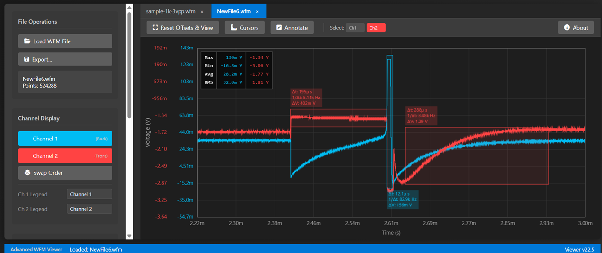

# Advanced Waveform Viewer

🌐 **Try it Live**: [**nezarati.github.io/waveform-viewer**](https://nezarati.github.io/waveform-viewer/index.html)

A powerful, self-contained HTML-based tool for viewing and analyzing waveform files. It natively supports binary `.wfm` files from **Rigol and Tektronix oscilloscopes** and can import data from standard `.csv` files or directly from your clipboard.

This viewer runs entirely in your web browser with zero installation, providing an immediate, cross-platform solution for engineers, students, and hobbyists. It extends basic viewing with a rich set of features for in-depth analysis, professional-grade exporting, and easy annotation.

***

## Screenshot

***

## Key Features

### 📂 File & Data Handling
* **Universal Oscilloscope Support**: Natively open `.wfm` files from both **Rigol** and **Tektronix** oscilloscopes.
* **CSV & Pasted Data**: Import data from `.csv` files with a powerful column mapping tool, or paste data directly from your clipboard using `Ctrl` + `V`.
* **Easy Loading**: Load files via the "Load File" button or by **dragging and dropping** them onto the page.
* **Multi-File Management**: Load multiple files simultaneously, each managed in a separate **tab**.
* **Session Management**: Save your entire workspace—including all loaded files, zoom levels, annotations, and cursors—into a single `.graphx` session file. Load it later to resume your work exactly where you left off.

***

### 📈 Waveform Display & Interaction
* **Multi-File Overlap View**: Click the **Overlap** icon (<i class="fas fa-layer-group"></i>) to create a dedicated **'Overlap' tab**. This powerful view combines all visible channels from all open files into a single, fully interactive chart, automatically assigning distinct colors for easy identification.
* **Stacked or Overlapped Views**: In individual file tabs, toggle between the default overlapped view and a **separate, stacked view** where each channel gets its own plot area for clear, uncluttered analysis.
* **Modern Chart Interaction**:
    * **Pan**:
        * Click and drag the chart background to pan all channels **horizontally and vertically** together.
        * In separate view, drag a subplot to pan it **vertically independently**.
        * Click and drag a specific waveform trace to adjust its vertical offset.
    * **Zoom**:
        * **Axis-Specific Zoom**: Hover your mouse over an axis and use the **Mouse Wheel** to zoom that axis independently.
        * **Area Zoom**: Press `Z` to activate zoom mode, then click and drag to select and zoom into a specific region.
    * **Snap to Common Scales**: An optional mode that provides a reliable, stepped zoom experience through standard `1-2-5` scale values (e.g., 1ms, 2ms, 5ms).
    * **Trace Identification**: **Hover the mouse over any waveform** to display a tooltip with its full name, perfect for distinguishing traces in crowded or overlapped views.
* **View Controls**:
    * **Fit & Reset View**:
        * Press `F` to **Fit Y-Axis**. If the mouse is over a specific axis or subplot, only that channel is fitted. Otherwise, all visible channels are fitted to the data currently in view.
        * **Double-Click** the plot to perform a **Full Reset**, fitting all visible data on both axes.
    * **Relative Time**: Set the start of the current view as $t=0$ for relative time measurements.
* **Channel Management**:
    * **Visibility**: **Single-click** a channel in the sidebar to toggle its visibility.
    * **Rename & Reorder**: **Double-click** a channel name in the sidebar to edit it. Use the "Swap Order" button to bring traces to the front.
    * **Custom Colors**: Use the built-in color picker next to each channel to customize its appearance.

***

### 📏 Measurements & Analysis
* **Live Measurement Table**: An on-screen table displays key statistics for the *visible* portion of each waveform.
    * **Available Calculations**: **Max**, **Min**, **Average**, and **RMS** voltage.
    * **Customizable**: Toggle which measurements are displayed.
* **Cursor Measurements**:
    * **Precise Readouts**: Enable two horizontal and two vertical cursors for precise readouts.
    * **Calculations**: Measures **$\Delta V$** (voltage difference), **$\Delta t$** (time difference), and frequency ($1/\Delta t$).
    * **Channel Tracking**: Cursors can "snap" to a selected channel's waveform, automatically updating their vertical position as you move them horizontally.
    * **Quick Set**: Instantly move cursors to the max/min voltage points in the current view.

***

### ✒️ Annotations
* **Annotation Channel Selection**: Precisely control which waveform is used as the reference for measurements and new annotations using the toolbar buttons or `1`-`9` keys.
* **Three Annotation Types**:
    * **Area Annotation (`Shift` + `Drag`)**: Draw a box on the plot to measure `Δt`, `ΔV`, and frequency. If **Annotate Mode** is active, the box becomes a persistent annotation upon release, displaying its measurements.
    * **Text Annotation (`T` key)**: Enter text mode, click anywhere on the plot, and type to add a label.
    * **Point Annotation (`P` key)**: Enter point mode and click directly on a waveform to create a marker that "snaps" to the trace and displays its exact (Time, Voltage) coordinates.
* **Manage Annotations**:
    * **Select & Move**: Click to select any annotation or its label and drag to move it.
    * **Edit Text**: **Double-click** any annotation's text to edit its content.
    * **Delete**: Press `Delete` to remove a selected annotation.
    * **Toggle Visibility**: Press `Ctrl` + `H` to hide or show all annotations on the chart.

***

### 📤 Exporting & Copying
* **Quick Copy**: Press `Ctrl` + `C` to copy the current view to the clipboard as a PNG image. A **"White BG Copy"** option is available for high-contrast pastes.
* **Advanced Export Dialog**: Generate professional-grade output for reports or data processing.
    * **Formats**: **PNG**, **SVG** (vector), and **CSV** (raw data).
    * **Data Scope**: Export either the current zoomed-in view or the entire waveform dataset.
    * **Styling Options**:
        * **White Background**: Creates a high-contrast, printer-friendly version.
        * **IEEE Style**: Formats the plot for academic publications (specific size, `10pt Times New Roman` font, simplified trace styles).
        * **Measurements Below Plot**: Option to place the measurement table neatly at the bottom.

***

## Technical Details

This viewer is intentionally designed as a single, self-contained `index.html` file. There are no external dependencies, no build steps, and no installation required.

* **Core Technology**: The application is built with vanilla **HTML5**, **CSS3**, and **JavaScript (ES6+)**.
* **Rendering Engine**: All waveform plotting, grids, and annotations are rendered using the **HTML5 Canvas API** for high-performance graphics.
* **Binary File Parsing**: The viewer includes custom-built parsers for the Rigol and Tektronix `.wfm` formats, directly manipulating the binary data using `DataView` to extract waveform points and metadata.

***

## How to Use

1.  **Download**: Save the `index.html` file to your computer.
2.  **Open**: Open the file in a modern web browser (e.g., Google Chrome, Firefox, Edge).
3.  **Load**: Drag a `.wfm`, `.csv`, or `.graphx` file onto the page, use the "Load File" button, or paste data with `Ctrl`+`V`.

***

## Shortcuts

| Action                      | Shortcut                    |
| :-------------------------- | :-------------------------- |
| **View Control** |                             |
| Fit Y-Axis (Channel or All) | `F` Key                     |
| Full Reset View             | `Double-Click` Plot         |
| Pan Chart (X & Y)           | `Mouse Drag`                |
| Zoom on Axis (X or Y)       | `Mouse Wheel` over axis     |
| **File & Data** |                             |
| Copy View to Clipboard      | `Ctrl` + `C`                |
| Paste Data from Clipboard   | `Ctrl` + `V`                |
| **Annotations & Tools** |                             |
| Toggle Area Zoom Mode       | `Z` Key                     |
| Toggle Text Annotation Mode | `T` Key                     |
| Toggle Point Annotation Mode| `P` Key                     |
| Quick Measure / Area Annotate| `Shift` + `Mouse Drag`      |
| Hide/Show All Annotations   | `Ctrl` + `H`                |
| Select Nth Channel          | `1` - `9` Keys              |
| Delete Selected Annotation  | `Delete` Key                |
| Exit Annotation/Zoom Mode   | `Escape` Key                |

***

## Contributing

Contributions are welcome! Please feel free to submit a pull request or create an issue for bugs, feature requests, or compatibility reports.

***

## License

This project is licensed under the [Creative Commons Attribution-NonCommercial-ShareAlike 4.0 International License](http://creativecommons.org/licenses/by-nc-sa/4.0/).

***

## Author

* **Ali NezaratiZadeh**
