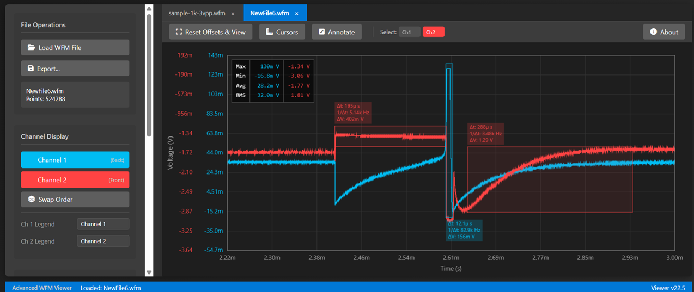

# Advanced WFM Waveform Viewer

🌐 **Try it Live**: [**nezarati.github.io/rigol-waveform-viewer**](https://nezarati.github.io/rigol-waveform-viewer/index.html)

A powerful, self-contained HTML-based tool for viewing and analyzing binary waveform files (`.wfm`) from **Rigol and Tektronix oscilloscopes**. This viewer runs entirely in your web browser with zero installation, providing an immediate, cross-platform solution for engineers, students, and hobbyists.

It extends basic viewing with a rich set of features for in-depth analysis, professional-grade exporting, and easy annotation.

***

## Screenshot

***

## Key Features

### 📂 File Handling
* **Universal WFM Support**: Open `.wfm` files from both **Rigol** and **Tektronix** oscilloscopes.
* **Easy Loading**: Load files via the "Load" button or by **dragging and dropping** them onto the page.
* **Multi-File Support**: Load multiple files simultaneously, each managed in a separate **tab**.
* **Probe Attenuation**: For Rigol files, set a **scale multiplier** (e.g., 1000 for a 1000x probe) upon loading to ensure correct voltage readings.
* **File Information**: The sidebar displays the filename, total data points, and detailed header information.

***

### 📈 Waveform Display & Interaction
* **Stacked or Overlapped Views**: Toggle between the default overlapped view and a **separate, stacked view** where each channel gets its own plot area for clear, uncluttered analysis.
* **Modern Chart Interaction**:
    * **Pan**:
        * Click and drag anywhere on the chart background to pan all channels **horizontally and vertically** together.
        * In separate view, drag a subplot to pan it **vertically independently**.
        * Click and drag a specific waveform trace to adjust its vertical offset.
    * **Axis-Specific Zoom**: Hover your mouse over an axis and use the **Mouse Wheel** to zoom that axis independently. Works for the time (bottom) axis and for each individual channel's voltage (left) axis.
    * **Area Zoom**: Press the `Z` key to activate zoom mode, then click and drag to select and zoom into a specific region.
* **View Controls**:
    * **Fit & Reset View**:
        * Press `F` to **Fit Y-Axis**. If the mouse is over a specific axis or subplot, only that channel is fitted. Otherwise, all visible channels are fitted to the data currently in view.
        * **Double-Click** the plot to perform a **Full Reset**, fitting all visible data on both axes.
    * **Relative Time**: Set the start of the current view as $t=0$ for relative time measurements.
* **Channel Management**:
    * Toggle channel visibility.
    * Swap the drawing order (bring a channel to the front).
    * Assign custom names to each channel.

***

### 📏 Measurements & Analysis
* **Live Measurement Table**: An on-screen table displays key statistics for the *visible* portion of each waveform.
    * **Available Calculations**: **Max**, **Min**, **Average**, and **RMS** voltage.
    * **Customizable**: Toggle which measurements are displayed.
* **Cursor Measurements**:
    * Enable two horizontal and two vertical cursors for precise readouts.
    * Measures **$\Delta V$** (voltage difference), **$\Delta t$** (time difference), and frequency ($1/\Delta t$).
    * **Channel Tracking**: Cursors can "snap" to a selected channel's waveform.
    * **Quick Set**: Instantly move cursors to the max/min voltage points in the current view.

***

### ✒️ Annotations
* **Quick Measurement / Area Annotation**: Hold `Shift` + `Drag` to draw a measurement box showing the region's $\Delta t$ and $\Delta V$. If **Annotate Mode** is active, the box becomes a persistent annotation upon release.
* **Text Annotation**: Press `T` to enter text mode and click on the plot to add labels.
* **Manage Annotations**: Select annotations to move or resize them. Press `Delete` to remove a selected annotation.

***

### 📤 Exporting & Copying
* **Quick Copy**: Press `Ctrl` + `C` to copy the current view to the clipboard as a PNG image. A **"B&W Copy"** option is available for high-contrast pastes.
* **Advanced Export Dialog**: Generate professional-grade output for reports or data processing.
    * **Formats**: **PNG**, **SVG** (vector), and **CSV** (raw data).
    * **Data Scope**: Export either the current zoomed-in view or the entire waveform dataset.
    * **Styling Options**:
        * **Black & White**: Creates a high-contrast, printer-friendly version.
        * **IEEE Style**: Formats the plot for academic publications (specific size, `10pt Times New Roman` font, simplified colors).
        * **Measurements Below Plot**: Option to place the measurement table neatly at the bottom.

***

## How to Use

1.  **Download**: Save the `index.html` file from this repository to your computer.
2.  **Open**: Open the file in a modern web browser (e.g., Google Chrome, Firefox, Edge).
3.  **Load**: Drag a `.wfm` file onto the page or use the "Load WFM File" button.

***

## Compatibility

This tool is designed to be compatible with `.wfm` files from a wide range of modern Rigol and Tektronix oscilloscopes. It has been tested with files from the following series:

* **Rigol**:
    * DS1000Z (e.g., DS1054Z)
    * MSO5000
* **Tektronix**:
    * Various series using the standard 16-bit integer `.wfm` format.

If your oscilloscope model is not listed, it is still likely to work. Please open an issue to confirm compatibility and help us update this list.

***

## Shortcuts

| Action | Shortcut |
| :--- | :--- |
| **View Control** | |
| Fit Y-Axis (Channel or All) | `F` Key |
| Full Reset View | `Double-Click` |
| Pan Chart (X & Y) | `Mouse Drag` |
| Zoom on Axis (X or Y) | `Mouse Wheel` over axis |
| **Actions** | |
| Toggle Area Zoom Mode (1-time use) | `Z` Key |
| Copy to Clipboard | `Ctrl` + `C` |
| Add Text Annotation | `T` Key |
| Quick Measure / Area Annotation | `Shift` + `Mouse Drag` |
| Delete Selected Annotation | `Delete` Key |

***

## Contributing

Contributions are welcome! Please feel free to submit a pull request or create an issue for bugs, feature requests, or compatibility reports.

***

## License

This project is licensed under the [Creative Commons Attribution-NonCommercial-ShareAlike 4.0 International License](http://creativecommons.org/licenses/by-nc-sa/4.0/).

***

## Author

* **Ali NezaratiZadeh**
